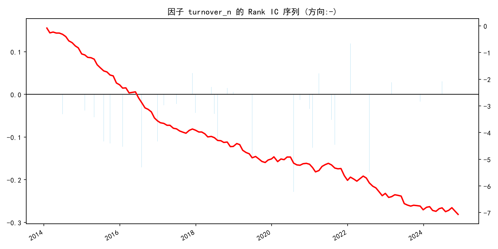
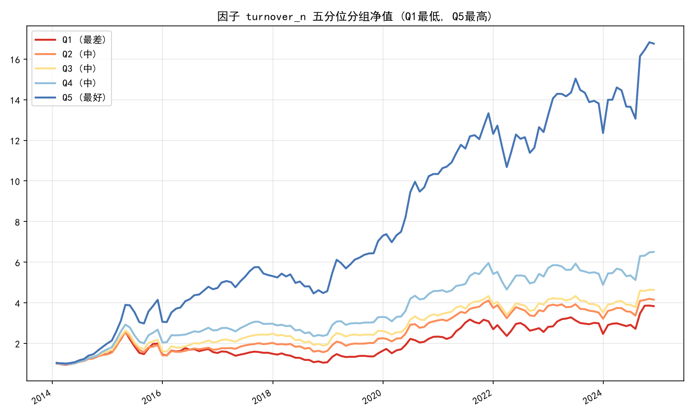

# A股多因子量化策略：从复现到因子发现

  

> 基于 AkShare 公开数据的 A 股多因子月度轮动策略。
> 完整实现 **Point-in-time 数据对齐 → ST/退市过滤 → 行业/市值中性化 → 滚动 ICIR 动态加权 → 行业集中度风控 → 停牌约束 → 宏观仓位管理 → 交易成本与无风险利率扣除 → 单因子 IC / 分组 / 分阶段稳定性检验** 的量化研究全流程。
> 11 年长周期回测（2014-01 ~ 2024-12，沪深800）：**年化收益 31.87%，超额夏普 1.30，最大回撤 -21.47%**。

---

## 📈 回测业绩（11 年长周期 · 实盘口径）

*股票池：沪深800（300+500，剔除ST/退市） | 调仓：每月月末 | 持仓：Top 30（单行业≤6只）等权 | 成本：双边千六 | 仓位：10月均线择时*

| 指标 | 多因子策略 | 沪深300基准 |
| :--- | :---: | :---: |
| **累计收益** | **1949.74%** 🚀 | 78.66% |
| **年化收益** | **31.87%** | 5.46% |
| **年化波动** | 23.03% | 21.94% |
| **超额夏普比率**（扣除2%无风险利率） | **1.30** 🏆 | 0.16 |
| **最大回撤** | **-21.47%** 🛡️ | -40.56% |
| **平均月度单边换手率** | 42.66% | - |
| **年化交易总成本** | 3.07% | - |
| **历史平均仓位** | 76.52% | 100% |


---

## 🗂 策略迭代历程

| 阶段 | 核心改进 | 回测口径 | 年化收益 | 夏普 | 最大回撤 |
| :--- | :--- | :--- | :---: | :---: | :---: |
| V1 | 六因子等权打分 | 19-24 / 60只 | 20.67% | 0.91* | -18.58% |
| V2 | + 行业/市值中性化 | 19-24 / 60只 | 21.91% | 0.98* | -18.95% |
| V3 | + 滚动 ICIR 动态加权 | 19-24 / 60只 | 23.43% | 1.03* | -21.22% |
| V4 | + 回归前去极值、中性化信号加权 | 19-24 / 60只 | 25.32% | 1.11* | -20.18% |
| V4c | + 扣除双边千六交易成本 | 19-24 / 60只 | 23.53% | 1.05* | -20.57% |
| V5 | + 长周期全量 + 10月均线仓位管理 | 14-24 / 300只 | 17.97% | 0.98* | -27.47% |
| V6 | + 行业集中度风控 + 超额夏普口径 | 14-24 / 300只 | 16.43% | 0.79 | -26.91% |
| V7 | + 沪深800扩池 + ST/退市过滤 | 14-24 / 800只 | 13.15% | 0.55 | -26.61% |
| V8 | + 1个月反转 + 1个月波动率因子 | 14-24 / 800只 | 17.71% | 0.75 | -22.01% |
| **最终版** | **+ 规模/换手率因子，剔除负债率因子** | **14-24 / 800只** | **31.87%** | **1.30** | **-21.47%** |

*\*注：V1–V5 夏普为毛收益口径；V6 起为扣除 2% 无风险利率的超额口径。*

---

## 🧠 策略逻辑

```
数据下载与本地缓存（多源容灾：新浪/腾讯/东财/百度/中证官网）
        ↓
股票池构建（沪深800并集，剔除 ST / 退市风险股）
        ↓
构建因子面板（Point-in-time 时点对齐，防未来函数）
        ↓
横截面处理：去极值 → 行业/市值中性化(OLS残差，规模因子豁免) → 去极值 → 标准化 → 方向调整
        ↓
合成打分：滚动 12 个月 ICIR 动态加权（负 ICIR 自动归零）
        ↓
选出 Top 30（单行业 ≤ 6 只；停牌股不可买入，持仓停牌强制持有）
        ↓
宏观仓位管理（基准站上10月均线→满仓；跌破→半仓）
        ↓
按目标权重与实际持仓计算换手，扣除交易成本
        ↓
回测评估 + 单因子 Rank IC / 五分位分组 / 分阶段稳定性检验
```

### 因子体系（8 因子）

| 因子 | 类别 | 方向 | 中性化后方向调整 IC (11年) | 数据源 |
| :--- | :--- | :---: | :---: | :--- |
| 换手率 | 量价 | 负向 | **+0.054** (ICIR 0.58) | 新浪日线换手率 |
| 总市值 | 规模 | 负向 | **+0.050** (ICIR 0.25) | 百度股市通（豁免中性化） |
| 1个月波动率 | 量价 | 负向 | **+0.045** (ICIR 0.33) | 前复权日线 |
| 1个月收益率 | 反转 | 负向 | **+0.032** (ICIR 0.27) | 前复权日线 |
| ROE | 质量 | 正向 | **+0.021** (ICIR 0.21) | 新浪财务（按披露日对齐） |
| PB | 价值 | 负向 | **+0.020** (ICIR 0.15) | 百度股市通 |
| 营收同比增速 | 成长 | 正向 | **+0.012** (ICIR 0.15) | 新浪财务 |
| 毛利率 | 质量 | 正向 | **+0.010** (ICIR 0.15) | 新浪财务 |

*注：资产负债率因子经消融检验 IC≈0，已剔除。*

---

## 🔬 研究洞察与分阶段稳定性检验

将 11 年划分为三个阶段（`output/subperiod_ic.csv`），揭示 A 股风格演变与因子本质：

| 中性化因子 | 2014-2017 | 2018-2021 | 2022-2024 | 稳定性结论 |
| :--- | :---: | :---: | :---: | :--- |
| **turnover_n** | +0.082 (ICIR 1.01) | +0.039 | +0.037 | **跨周期顶级 Alpha**，三期全正 |
| **mcap_n** | +0.041 | +0.049 | +0.066 | 优质池中小市值效应全天候有效 |
| **vol_1m_n** | +0.074 | +0.011 | +0.050 | 低波动异象稳健 |
| **mom_1m_n** | +0.045 | +0.021 | +0.028 | 短周期反转三期全正 |
| **roe_n** | +0.033 | +0.028 | −0.005 | 核心资产时代王者，价值回归期失效 |
| **pb_n** | +0.049 | −0.026 | +0.042 | 典型 regime 翻转型价值因子 |
| **revenue_yoy_n** | +0.015 | +0.027 | −0.012 | 成长抱团期因子 |

1. **低换手率是 A 股跨越牛熊的顶级 Alpha**：`turnover_n` 三期 IC 全正、胜率均超 60%，2014-2017 期间 ICIR 高达 1.01。筹码锁定的冷门股长期跑赢博弈激烈的热门股。
2. **小市值效应在优质池中全天候有效**：在剔除 ST/退市股的沪深800样本中，`mcap` 打破“仅特定年份有效”的刻板印象，三期 IC 皆为正。
3. **短周期量价因子强于基本面因子**：1 个月反转与低波动的跨周期稳定性显著优于 6 个月动量与传统基本面因子。
4. **基本面因子具有 regime 依赖性**：ROE/营收增速在 2018-2021 抱团期强、2022-2024 失效；PB 呈周期翻转；毛利率在 300 池为纯噪音、在 800 池弱有效。
5. **中性化“救活”基本面因子**：短周期中 ROE 原始 IC 为负，剔除行业贝塔后翻正。
6. **动态加权实现风格自适应**：滚动 ICIR 机制在抱团期重仓基本面、在价值回归期切换至量价与规模因子。
7. **宏观风控“少亏”胜过“多赚”**：10 月均线择时使平均仓位 76.52%，最大回撤长期控制在 -21%~-27% 区间。
8. **流动性溢价的代价（诚实声明）**：最终版高收益部分来源于承担冷门股的流动性风险；实盘落地前需引入“日均成交额”硬过滤以挤出隐性冲击成本。

### 单因子检验示例

*IC 序列与累计 IC（方向调整后排序，Q5 恒为理论最优组）：*



*五分位分组净值（毛收益口径）：*



---

## 🛡️ 交易成本与实盘可行性

- **成本设定**：单边千分之三（含佣金、印花税、滑点），换入换出各计一次；仓位变动与行业/停牌约束产生的交易同样计费。
- **换手特性**：平均月度单边换手率 42.66%，年化成本约 3.07%；量价因子带来的 Alpha 远超摩擦成本。
- **超额口径**：夏普扣除 2% 无风险利率，策略超额夏普 1.30 约为基准（0.16）的 8 倍。
- **实盘前置条件**：加入日均成交额过滤、涨跌停约束后方可实盘。

---

## 📁 项目结构

```
a-share-multi-factor/
├── main.py               # 主入口：串联全流程
├── config.py             # 全局参数（区间/股票池/因子方向/开关/成本/风控）
├── requirements.txt
├── README.md
├── src/
│   ├── __init__.py
│   ├── data.py           # 数据层：多源容灾 + Parquet缓存 + 时点对齐 + 停牌判定
│   ├── factors.py        # 因子层：去极值/中性化/标准化/打分/行业约束/强制持有选股
│   ├── backtest.py       # 回测层：仓位管理/换手成本/超额绩效/净值图
│   └── factor_test.py    # 检验层：Rank IC/五分位/滚动ICIR/分阶段稳定性
├── data/cache/           # 本地数据缓存（不上传）
└── output/               # 输出：净值图/IC图/分组图/结果文件
```

---

## 🛠 技术栈与数据源

- **语言环境**：Python 3.11（推荐）
- **数据获取**：AkShare 多源容灾（行情/换手率：新浪→腾讯→东财；估值：百度股市通；成分股：中证官网；财务：新浪）
- **数据处理**：pandas 2.x / NumPy / SciPy（OLS 中性化、Spearman IC）
- **缓存机制**：本地 Parquet / CSV，二次运行秒开，支持中断续跑

---

## 📥 快速开始

```bash
# 1. 克隆仓库
git clone https://github.com/Stevenlu1208/a-share-multi-factor.git
cd a-share-multi-factor

# 2. 创建虚拟环境（推荐 Python 3.11）
python -m venv .venv
# Windows:
.venv\Scripts\Activate.ps1
# macOS / Linux:
# source .venv/bin/activate

# 3. 安装依赖
pip install -r requirements.txt

# 4. 运行回测（首次需下载全量数据，约1-2小时；之后秒开）
python main.py
```

> ⚠️ **环境注意**：本项目依赖 pandas 2.x 的 `groupby.apply` 行为，`requirements.txt` 已锁定 `pandas<3`。误装 pandas 3.x 可能出现面板为空的兼容性问题。

### 运行输出（output/）

| 文件 | 说明 |
| :--- | :--- |
| `nav.png` | 策略 vs 基准净值曲线 |
| `metrics.json` | 绩效指标（年化/超额夏普/回撤） |
| `ic_summary.csv` | 全部因子 IC / ICIR / 胜率汇总 |
| `subperiod_ic.csv` | 因子分阶段稳定性报告 |
| `ic_series_*.png` | 各因子 IC 序列与累计 IC 图 |
| `quintile_*.png` | 各因子五分位分组净值图（方向调整后排序） |
| `factor_panel.csv` | 因子面板（原始/中性化/标准化/得分） |
| `holdings.csv` | 历史每月持仓明细 |

---

## ⚙️ 配置指南（config.py）

| 参数 | 默认值 | 说明 |
| :--- | :--- | :--- |
| `DATA_START_DATE` | 2013-01-01 | 数据预热起点 |
| `START_DATE` / `END_DATE` | 2014 / 2024 | 回测区间（11年） |
| `UNIVERSE_INDEX` | ["000300","000905"] | 股票池（多指数并集，可改 000852 等） |
| `INDEX_SYMBOL` | "sh000300" | 基准指数（净值对比+择时） |
| `MAX_STOCKS` | None | 抽样数量，None 为全量 |
| `TOP_N` | 30 | 每期持仓数量 |
| `MAX_PER_INDUSTRY` | 6 | 单行业持仓上限 |
| `NEUTRALIZE_INDUSTRY` / `NEUTRALIZE_MCAP` | True | 中性化开关 |
| `NO_NEUTRALIZE_FACTORS` | ["mcap"] | 豁免中性化的因子（保留原始规模信号） |
| `USE_IC_WEIGHTS` | True | 滚动 ICIR 动态加权（False=等权） |
| `IC_WEIGHT_WINDOW` | 12 | 权重回看窗口（月） |
| `TRADE_COST_SINGLE` | 0.003 | 单边交易成本（含滑点） |
| `RISK_FREE_ANNUAL` | 0.02 | 无风险利率（超额夏普口径） |
| `USE_POSITION_CONTROL` | True | 宏观仓位管理开关 |
| `POSITION_METHOD` | "ma" | "ma"=N月均线 / "drawdown"=回撤分档 |
| `POSITION_MA_MONTHS` / `POSITION_LOW` | 10 / 0.5 | 均线周期 / 破位后仓位 |
| `SUSPENSION_GAP_DAYS` | 7 | 停牌判定阈值（自然日） |
| `FFILL_LIMIT` | 3 | 停牌期价格填充月数上限 |

---

## ⚠️ 局限性说明

1. **幸存者偏差**：使用当前指数成分股回测历史，未使用历史时点成分股；
2. **ST 过滤为当前时点**：免费数据无历史 ST 名单，历史 ST  episode 未剔除；
3. **流动性简化**：未过滤低成交额股票，高收益中含流动性溢价；未处理涨跌停无法成交；
4. **财务指标为单期报告值**：未做 TTM；披露日采用保守固定滞后；
5. **检验口径**：单因子 IC 与分组图为毛收益口径；
6. **数据源依赖公开接口**：可用性受上游网站策略影响。

## 🚧 未来工作

- [ ] 日均成交额过滤（挤出流动性溢价水分）
- [ ] 涨跌停可交易性约束
- [ ] 历史成分股与点时行业/ST 分类（需付费数据）
- [ ] 财务指标 TTM 化
- [ ] 中证1000 / 全市场样本外泛化测试
- [ ] 每月实盘选股脚本（输出下期推荐持仓）

---

## 📜 免责声明

本项目仅供量化学习与研究使用，回测结果不构成任何投资建议。市场有风险，投资需谨慎。

---

## 👤 作者

**StevenLu** · [GitHub](https://github.com/Stevenlu1208)