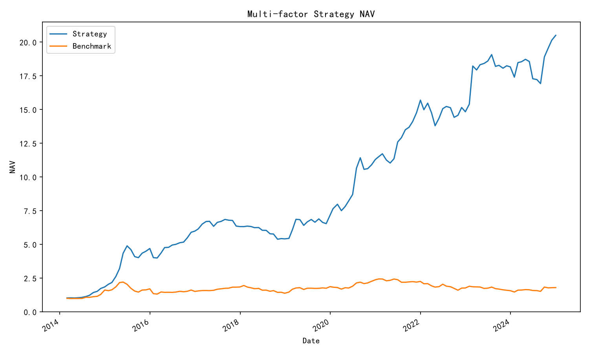
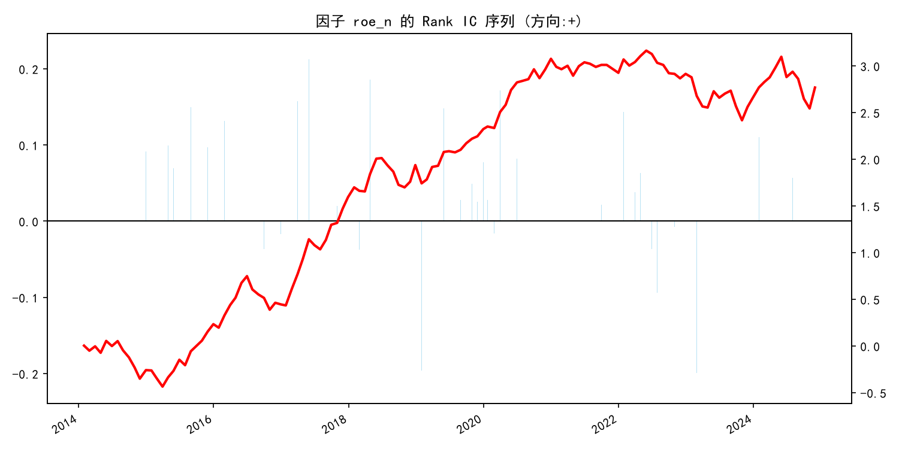
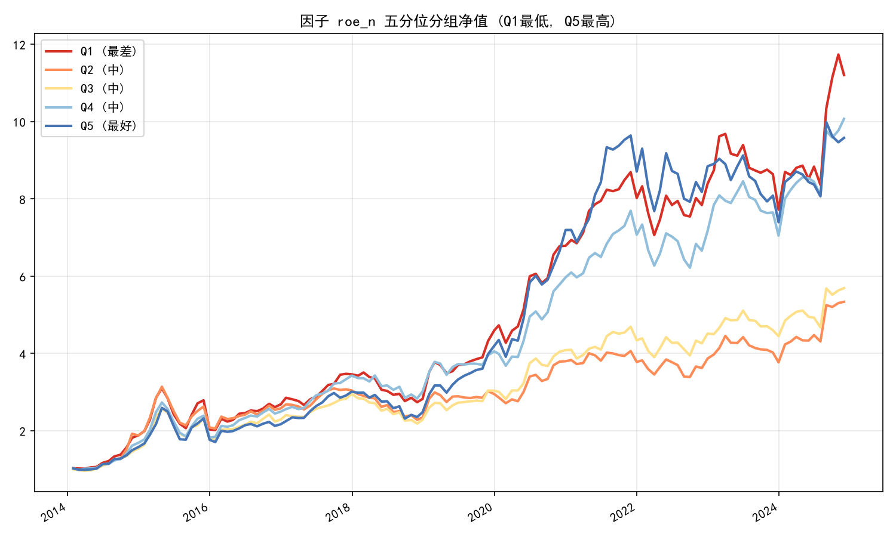

# A股「质量 + 价值 + 成长」多因子策略复现

  

> 基于 AkShare 公开数据的 A 股多因子月度轮动策略。
> 完整实现 **Point-in-time 数据对齐 → 行业/市值中性化 → 滚动 ICIR 动态加权 → 宏观仓位管理 → 交易成本扣除 → 单因子 IC 与分组检验** 的量化研究全流程。
> 11 年长周期回测（2014-01 ~ 2024-12，全量沪深300，已扣成本与择时）：**年化收益 17.97%，夏普比率 0.98，最大回撤 -27.47%**。

---

## 📈 回测业绩（11 年长周期 · 实盘口径）

*股票池：沪深300全量成分股 | 调仓频率：每月月末 | 持仓：Top 30 等权 | 成本：双边千分之六 | 仓位：10月均线择时*

| 指标 | 多因子策略 | 沪深300基准 |
| :--- | :---: | :---: |
| **累计收益** | **507.21%** 🚀 | 78.66% |
| **年化收益** | **17.97%** | 5.46% |
| **年化波动** | 18.67% | 21.94% |
| **夏普比率** | **0.98** 🏆 | 0.35 |
| **最大回撤** | **-27.47%** 🛡️ | -40.56% |
| **平均月度单边换手率** | 23.99% | - |
| **年化交易总成本** | 1.73% | - |
| **历史平均仓位** | 76.52% | 100% |



---

## 🗂 策略迭代历程

| 版本 | 核心改进 | 回测口径 | 年化收益 | 夏普 | 最大回撤 |
| :--- | :--- | :--- | :---: | :---: | :---: |
| V1 | 六因子等权打分 | 19-24 / 60只 | 20.67% | 0.91 | -18.58% |
| V2 | + 行业/市值中性化 | 19-24 / 60只 | 21.91% | 0.98 | -18.95% |
| V3 | + 滚动 ICIR 动态加权 | 19-24 / 60只 | 23.43% | 1.03 | -21.22% |
| V4 | + 回归前去极值、中性化信号加权 | 19-24 / 60只 | 25.32% | 1.11 | -20.18% |
| V4c | + 扣除双边千六交易成本 | 19-24 / 60只 | 23.53% | 1.05 | -20.57% |
| V4-L | 长周期 + 全量股票池 | 14-24 / 300只 | 19.35% | 0.82 | -33.74% |
| **V5** | **+ 10月均线宏观仓位管理** | **14-24 / 300只** | **17.97%** | **0.98** | **-27.47%** |

*注：V1–V4c 为 6 年抽样池上的方法论校准阶段；最终结论以 11 年全量口径（V4-L / V5）为准。V5 以仅 1.38% 的年化代价，换取最大回撤缩减 6.27%，实现极优的风险收益交换。*

---

## 🧠 策略逻辑

```
数据下载与本地缓存（多源容灾：新浪/腾讯/东财/百度/中证官网）
        ↓
构建因子面板（Point-in-time 时点对齐，防未来函数）
        ↓
横截面处理：去极值 → 行业/市值中性化(OLS残差) → 去极值 → 标准化 → 方向调整
        ↓
合成打分：滚动 12 个月 ICIR 动态加权（负 ICIR 自动归零）
        ↓
选出 Top 30，等权构建目标组合
        ↓
宏观仓位管理（基准站上10月均线→满仓；跌破→半仓）
        ↓
按目标权重与实际持仓计算换手，扣除交易成本
        ↓
回测评估 + 单因子 Rank IC / 五分位分组检验
```

### 因子体系

| 因子 | 类别 | 方向 | 中性化后方向调整 IC (11年) | 数据源 |
| :--- | :--- | :---: | :---: | :--- |
| ROE | 质量 | 正向 | **+0.016** (胜率58.8%) | 新浪财务指标（按披露日对齐） |
| PB | 价值 | 负向 | **+0.017** | 百度股市通历史估值 |
| 营收同比增速 | 成长 | 正向 | **+0.006** (胜率54.2%) | 新浪财务指标 |
| 资产负债率 | 风险 | 负向 | +0.003 | 新浪财务指标 |
| 过去6个月收益率 | 反转 | 负向 | +0.003 | 前复权日线 |
| 毛利率 | 质量 | 正向 | ≈ 0.000 | 新浪财务指标 |

---

## 🔬 研究洞察与分阶段稳定性检验

为了验证因子在不同市场 Regime（体制）下的稳健性，本项目将 11 年回测期划分为三个阶段进行 IC 检验，揭示了 A 股风格的深刻演变与动态加权机制的核心价值：

1. **价值因子（PB）的周期翻转特性**：`pb_n` 在 2014-2017 与 2022-2024 的估值修复期高度有效（IC > 0.04），但在 2018-2021 的核心资产抱团期严重失效（IC < 0）。
2. **基本面因子（ROE/营收增速）的时代局限**：`roe_n` 与 `revenue_yoy_n` 在 2018-2021 的“茅指数/宁组合”抱团牛市中表现极佳（IC ≈ 0.03），但在 2022-2024 的价值回归期遭遇“杀估值”而双双失效（IC < 0）。
3. **反转因子（mom_6m）的熊市防御价值**：在 2022-2024 的震荡阴跌市中，短期反转因子异军突起（IC 达 0.026），成为市场缺乏主线时的核心 Alpha 来源。
4. **毛利率因子的无效性**：`gross_margin_n` 在长达 11 年的三个周期中 IC 均趋近于 0，证明在 A 股“同行业内的高毛利”无法转化为超额收益，属于纯噪音因子。
5. **动态加权是穿越牛熊的灵魂**：面对上述剧烈的风格切换，滚动 ICIR 机制在 2018-2021 自动重仓基本面因子，在 2022-2024 自动切换至价值与反转因子。这种“不预测未来，只跟随当下最强信号”的自适应能力，是策略能够跨越 11 年周期并维持夏普 0.98 的根本原因。

### 单因子检验示例

*IC 序列与累计 IC：*



*五分位分组净值（Q1最低 ~ Q5最高）：*



---

## 🛡️ 交易成本与实盘可行性

- **成本设定**：单边千分之三（含佣金、印花税、滑点），换入换出各计一次；仓位变动产生的交易同样计费。
- **换手特性**：全量池 + 择时下平均月度单边换手率 23.99%，年化成本约 1.73%。
- **结论**：Alpha 显著覆盖摩擦成本，非“给券商打工”型策略。

---

## 📁 项目结构

```
a-share-multi-factor/
├── main.py               # 主入口：串联全流程
├── config.py             # 全局参数（区间/股票池/因子方向/开关/成本/仓位）
├── requirements.txt
├── README.md
├── src/
│   ├── __init__.py
│   ├── data.py           # 数据层：多源容灾 + Parquet缓存 + 时点对齐
│   ├── factors.py        # 因子层：去极值/中性化/标准化/打分/选股
│   ├── backtest.py       # 回测层：仓位管理/换手成本/组合收益/绩效/净值图
│   └── factor_test.py    # 检验层：Rank IC/五分位分组/滚动ICIR权重
├── data/cache/           # 本地数据缓存（不上传）
└── output/               # 输出：净值图/IC图/分组图/结果文件
```

---

## 🛠 技术栈与数据源

- **语言环境**：Python 3.11（推荐）
- **数据获取**：AkShare 多源容灾（行情：新浪→腾讯→东财；估值：百度股市通；成分股：中证官网；财务：新浪）
- **数据处理**：pandas 2.x / NumPy / SciPy（OLS 中性化、Spearman IC）
- **缓存机制**：本地 Parquet / CSV，二次运行秒开

---

## 📥 快速开始

```bash
# 1. 克隆仓库
git clone https://github.com/Stevenlu1208/a-share-multi-factor.git
cd a-share-multi-factor

# 2. 创建虚拟环境（推荐 Python 3.11）
python -m venv .venv
# Windows:
.venv\Scripts\Activate.ps1
# macOS / Linux:
# source .venv/bin/activate

# 3. 安装依赖
pip install -r requirements.txt

# 4. 运行回测（首次需下载全量数据，约20-40分钟；之后秒开）
python main.py
```

> ⚠️ **环境注意**：本项目依赖 pandas 2.x 的 `groupby.apply` 行为，`requirements.txt` 已锁定 `pandas<3`。误装 pandas 3.x 可能出现面板为空的兼容性问题。

### 运行输出（output/）

| 文件 | 说明 |
| :--- | :--- |
| `nav.png` | 策略 vs 基准净值曲线 |
| `metrics.json` | 绩效指标（年化/夏普/回撤） |
| `ic_summary.csv` | 全部因子 IC / ICIR / 胜率汇总 |
| `ic_series_*.png` | 各因子 IC 序列与累计 IC 图 |
| `quintile_*.png` | 各因子五分位分组净值图 |
| `factor_panel.csv` | 因子面板（原始/中性化/标准化/得分） |
| `holdings.csv` | 历史每月持仓明细 |

---

## ⚙️ 配置指南（config.py）

| 参数 | 默认值 | 说明 |
| :--- | :--- | :--- |
| `DATA_START_DATE` | 2013-01-01 | 数据预热起点（动量因子需要历史） |
| `START_DATE` / `END_DATE` | 2014 / 2024 | 回测区间（11年） |
| `UNIVERSE_INDEX` | 000300 | 股票池指数（可改 000905 做中证500泛化测试） |
| `MAX_STOCKS` | None | 抽样数量，None 为全量 |
| `TOP_N` | 30 | 每期持仓数量 |
| `NEUTRALIZE_INDUSTRY` / `NEUTRALIZE_MCAP` | True | 中性化开关 |
| `USE_IC_WEIGHTS` | True | 滚动 ICIR 动态加权（False=等权） |
| `IC_WEIGHT_WINDOW` | 12 | 权重回看窗口（月） |
| `TRADE_COST_SINGLE` | 0.003 | 单边交易成本（含滑点） |
| `USE_POSITION_CONTROL` | True | 宏观仓位管理开关 |
| `POSITION_METHOD` | "ma" | "ma"=N月均线择时 / "drawdown"=回撤分档降仓 |
| `POSITION_MA_MONTHS` | 10 | 月均线周期 |
| `POSITION_LOW` | 0.5 | 跌破均线后的仓位 |

---

## ⚠️ 局限性说明

1. **幸存者偏差**：使用当前沪深300成分股回测历史，未使用历史时点成分股；
2. **行业分类为当前 membership**：免费数据限制，未做到时点化行业归属；
3. **财务指标为单期报告值**：未做 TTM 处理；
4. **交易简化**：未处理涨跌停无法成交、停牌强制持有等细节（停牌价格 ffill 1 个月）；现金仓位收益按 0 计算（保守口径）；
5. **数据源依赖公开接口**：可用性受上游网站策略影响。

## 🚧 未来工作

- [ ] 历史成分股与点时行业分类，进一步消除幸存者偏差
- [ ] 财务指标 TTM 化
- [ ] 换手率约束 / 组合优化器（行业权重硬约束）
- [ ] 中证500 / 中证1000 样本外泛化测试
- [ ] 每月实盘选股脚本（输出下期推荐持仓）

---

## 📜 免责声明

本项目仅供量化学习与研究使用，回测结果不构成任何投资建议。市场有风险，投资需谨慎。

---

## 👤 作者

**StevenLu** · [GitHub](https://github.com/Stevenlu1208)